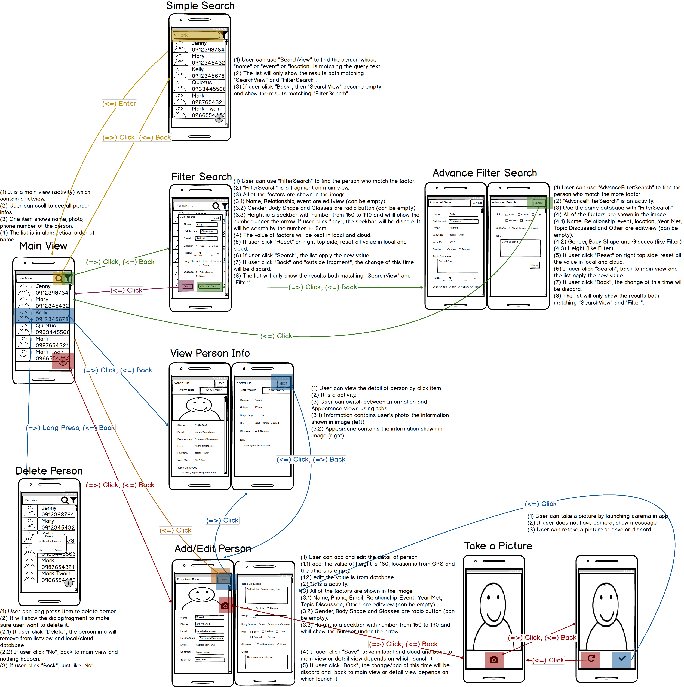

# Group Project  - *IMet*

**IMet** is an app that help users to memorize the details of other people. User can store information of people they’ve met and quickly search through the data to find the name and info of the person standing in front of them, know that he/she has met somewhere before, but just can’t recall who the person is. Since the user is assumed to remember almost nothing about the person, being able to search by the data of appearance is critical. For example, the user should be able to search “female”, “about 165cm tall”, “fat”, “wears glasses” and find a list of people that match these criteria. Of course, if the user remembers other information about the person other than appearance, they can use them for searching as well, such as the event and location they’ve met, their relationship… etc. We hope that people who aim to build strong interpersonal relationships like community organizers and sales will benefit from IMet greatly. 

## User Stories

The following **required** functionality is completed:

* [x] Main view (Main_Activity, Person Item)
  * [x] User can view all of the person items
  * [x] User can tap on person item to view the person’s detail item

* [ ] Add/Edit Person Detail (Detail_Activity)
  * [x] User can edit person detail anytime she/he wants
  * [x] User can store the information and characteristics of the people they meet, including:
    * [x] Personal Info: Name, email, phone number, relationship with the user, event/location that the user and the person have met for the first time, interest topic talked about…etc.
    * [x] Appearance: Gender, approximate height, fat or skinny, hair color and length, glasses or no glasses, and “other appearance characteristics” (ex: hot looking, crooked teeth, pitchy voice)
    * [ ] Photos: Photo of business card, photo of the person taken secretly from afar, photo of the event that the user has met the person (note: even if it’s not a photo of the person, photo of the event/location helps to recall who they are)
    * [ ] User can take photo by launching camera in app
    * [ ] The location is filled by GPS automatically

* [x] User can click a "Add" icon to add person
  * [x] Use FloatingActionButton  and CoordinatorLayout 

* [x] User can enter a search query on SearchView to find a person by name and event
* [x] User can click on "filter" icon which allows selection of more search options to filter out the people that match this criteria
  * [x] User can click "advanced filter" to have full search options to filter
  * [x] User can query limited information for fast and easy searching, such as being able to get the name and info of the person knowing only about the person’s appearance. 
  * [x] Any other information can be used for searching as well, if the user remembers any. (included above)
  * [x] User can reset the filter

* [x] User can view the detail of person by click item on main view.
  * [x] The detail of person has two parts: Information and Appearance.
  * [x] User can switch between Information and Appearance view using tabs.

* [x] User can remove "person item" ("person detail")
* [x] User can view more people items as they scroll with infinite pagination
* [ ] Store All of the data in cloud and set/get by restful API
* [x] Person information are persisted into SQLite and can be displayed from the local DB
  * [x] User can open the app offline
* [ ] Improve the UI / UX of our app

The following **optional** features are implemented:
* [ ] when user can chabge moblie or have more than one device, just login his/her account and all data will be the same
  * [ ] User can sign up by OAuth login (ex. FB, Twitter)
  * [ ] User can sign up by creating a new account
* [ ] When a network request is sent, user sees an indeterminate progress indicator
* [ ] User can view other’s email and phone number and start it directly
* [ ] User can take more than one picture
* [ ] User can change the order of main view by different label (ex. Name, event, location)
* [ ] User can delete more than one person at one time
* [ ] Have onboarding page - First-time user visual tutorial for how the app works

## Wireframe

## Video Walkthrough

Here's a walkthrough of implemented user stories:
[Link to Video Walkthrough](https://www.dropbox.com/s/2o9tydb7j3ogzam/IMet_milestone2.mp4?dl=0)

## License

    Copyright 2017 Jennifer Chan, TzuChun (Kelly) Chen, Quietus Chung

    Licensed under the Apache License, Version 2.0 (the "License");
    you may not use this file except in compliance with the License.
    You may obtain a copy of the License at

        http://www.apache.org/licenses/LICENSE-2.0

    Unless required by applicable law or agreed to in writing, software
    distributed under the License is distributed on an "AS IS" BASIS,
    WITHOUT WARRANTIES OR CONDITIONS OF ANY KIND, either express or implied.
    See the License for the specific language governing permissions and
    limitations under the License.
